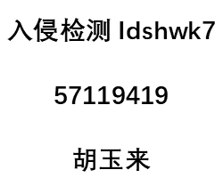

# idshwk7 作业说明：

本次作业使用LSB方法将一张200x250的数字图像水印隐藏到了另一张640x640的载体图像中。

两张图像如下：

- 载体图像：carrier.png


- 水印图像watermark.png



程序说明：

```shell
# 生成带水印的图像test.png
python3 Encrypt.py
# 从带水印的图像中提取水印
python3 Decrypt.py
```

注意事项：需要安装PIL库`pip install Pillow`和Numpy库`pip install numpy`
